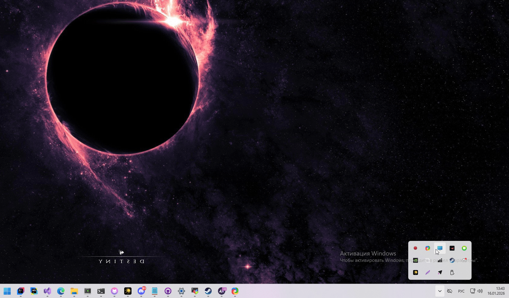

# XTZ LED Desktop Controller

**XTZ LED Controller** — это легковесное Windows-приложение (Tray App), написанное на **C++ и Qt**, предназначенное для управления адресными светодиодными лентами (WS2812B). Приложение работает в паре с прошивкой [WemosD1-ARGB-Controller](https://github.com/0xFruzz/WemosD1-ARGB-Controller).

---
## Совместимая прошивка
[WemosD1-ARGB-Controller](https://github.com/0xFruzz/WemosD1-ARGB-Controller)
Приложение взаимодействует с API контроллера ESP8266 через стандартные HTTP-запросы:
* `GET /stats` — получение текущих значений RGB и яркости в формате JSON.
* `GET /setup?r=...&g=...&b=...` — отправка новых параметров цвета.

---

### Требования
* **ОС:** Windows 10/11
* **IDE:** Visual Studio 2022
* **Framework:** Qt 6.x (модули: `Widgets`, `Network`)
* **Компилятор:** MSVC 2019/2022

## Использование

1. **Запуск:** Приложение сворачивается в системный трей.
2. **Конфигурация:** Через пункт `Network Settings` укажите подсеть (например, `192.168.31`).
3. **Поиск:** Используйте `Scan for Devices` для обнаружения активных контроллеров.
4. **Управление:** Клик по названию устройства в списке открывает стандартный диалог выбора цвета.

---

## Демонстрация

